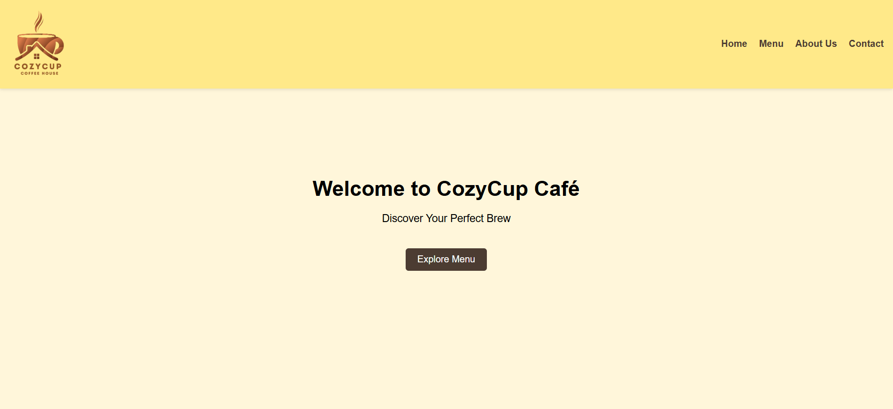
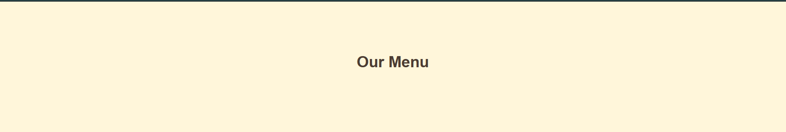
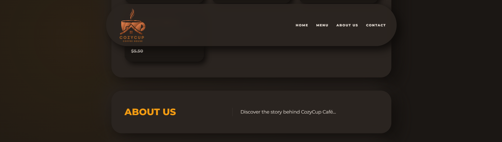
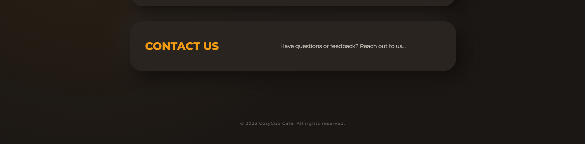

# Cozycup Cafe

## Project Description
Cozy Cup Cafe is a web-based cafe website to showcase our coffee shop' menus and brand. It also focuses on a user-friendly layout.

### Features
- Simple website layout
- Easy-to-navigate website structure

#### Screen Captures
This screen shows the homepage of Cozy Cup Cafe.

This is the Menu 

This is the About Us section

This is the Contact Page

## Authors

**Name**: Francis William Garcia  
**Email**: example@gmail.com  

  

**Name**: LanceSthur Tapaya  
**Email**: example@gmail.com  

